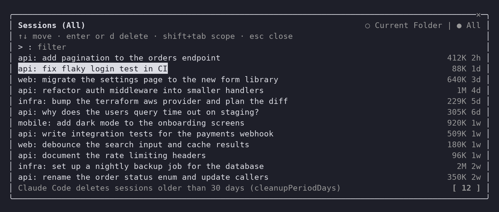
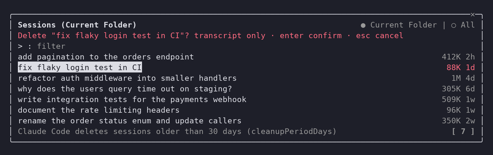

# session-cleaner

[](https://github.com/r0charm/claude-session-cleaner/actions/workflows/checks.yml)

A Claude Code plugin that adds `/sessions`: a picker to filter and delete your sessions.





## Keys

- type: filter by title, id or folder
- `↑` `↓`: move between the filter and the sessions
- `enter` or `d` on a session: ask to delete it, then `enter` confirms, `esc` cancels
- `enter` on the filter: select the first match (the filter clears)
- `shift+tab` from the filter to the scope toggle, then `enter`: current folder or all
- `esc`: close

To resume a session, use Claude Code's own `/resume`.

To open it straight from a terminal:

```
claude /sessions
```

or, with `alias sessions='claude /sessions'` in your shell profile, just `sessions`.

## What it runs and sends

It sends nothing: no network calls. It works only inside your Claude Code configuration directory (`$CLAUDE_CONFIG_DIR`, else `~/.claude`), and runs these programs directly, never through a shell:

| Program | Why |
|---|---|
| `grep` | read a session's title without loading the whole transcript |
| `ps` | hide sessions that are still running |
| `rm -rf --` | the delete, after you confirm: the session's transcript and its leftover folders, only paths named by the session id |

Hooks: `session.start` registers `/sessions`, `command.run` opens the picker on `/sessions` only, and `ui.focus`, `ui.close`, `ui.render` act on the picker's own pane only.

## Install

```
/plugin install session-cleaner --marketplace r0charm/claude-session-cleaner
```

Answer `y` to add the marketplace, then pick a scope. Needs Claude Code 2.1.287 or newer, the release that added plugin mods; 2.1.290 or newer is safest. Mods are early access in Claude Code, so a later release may change what the plugin relies on.

To try it from a checkout without installing:

```
claude --plugin-dir /path/to/claude-session-cleaner
```
